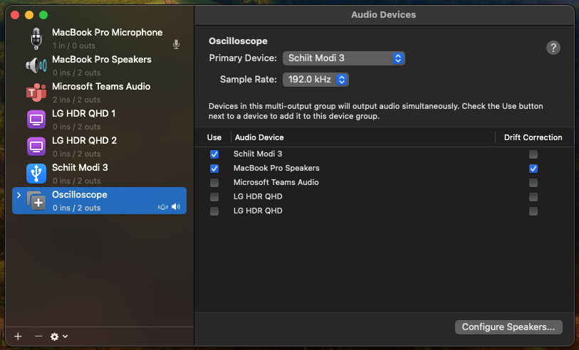
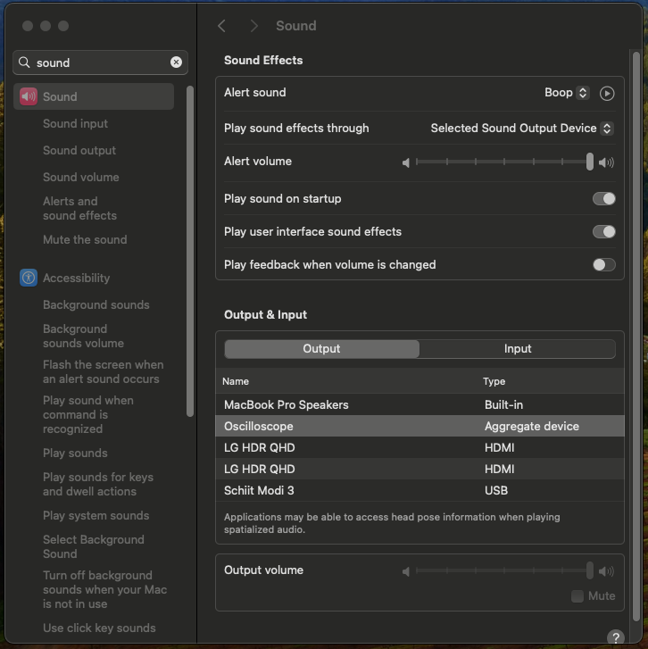

# [](https://github.com/daniel-sudz/pie/actions/workflows/build.yaml) Osciliscope Music PIE Team 
This contains code for our final PIE project (osciliscope music) at Olin College of Engineering. 

# Arduino
The ```arduino``` folder includes all the code run on an ```Arduino Uno``` to handle our custom keyboard and potentiometer inputs which are streamed to serial output. 

# Visualizer 
The ```visualizer``` folder is a high-performance c++ program for consuming arduino serial input and driving the osciliscope music output. 

## Visualizer: Audio Setup [MACOS]
To support both the Etch-A-Sketch rendering and the audio output, you should setup a combined audio device that will split the generated audio output between an external DAC (driving the physical oscilliscope) and a speaker. 

The only requirement is that the physical DAC should support a two-channel output of 192kHz. Below are instructions on how to configure a combined audio device on Macos. See the official article https://support.apple.com/guide/audio-midi-setup/play-audio-through-multiple-devices-at-once-ams7c093f372/mac for more details. 

<p align="center">
  
</p>
<p align="center">
  In the "Audio MIDI Setting" create a "Multi-Output Device" called "Oscilloscope" that combines your external DAC driving the physical osciliscope with you desired speaker's output. We have found that the built in speakers on the latest Macbook's sound quite pleasant and are more than good enough. 
</p>

<p align="center">
  
</p>
<p align="center">
  Select the "Oscilloscope" device that you created in the audio output
</p>

## Visualizer: Running Instructions [ANY]

```bash
danielsudz@Daniels-MacBook-Pro-5 visualizer % sudo ./etch-sketch-loop
[INFO]: Located arduino serial port at /dev/tty.usbmodem11401
[INFO SERIAL]: The serial port has opened succesfully
[INFO AUDIO]: started initializing portaudio
[INFO AUDIO]: finished initializing portaudio
[INFO AUDIO]: FOUND THE SCHIIT BOX
[INFO AUDIO]: Sample rate of 192000 is supported!!!
[INFO SERIAL]: Currently holding 1 pot value and playing freq 0 frequency
```

From the `visualizer` folder run `sudo ./etch-sketch-loop` to start the program. 

# Install
To clone the repo correctly use the following flags
```bash 
git clone --recurse-submodules https://github.com/daniel-sudz/pie/
```
The ```--recurse-submodules``` flag will include the ```portaudio``` and ```libserial``` dependencies necessary for building the ```visualizer``` project. 

# Build Instruction
Take a look at the official CI build scripts to setup a similar environment for your operating system here: https://github.com/daniel-sudz/pie/blob/main/.github/workflows/build.yaml.

We currently officially test against the following build targets: `[ubuntu-20.04, ubuntu-22.04, ubuntu-latest, macos-12, macos-13, macos-latest]`.
